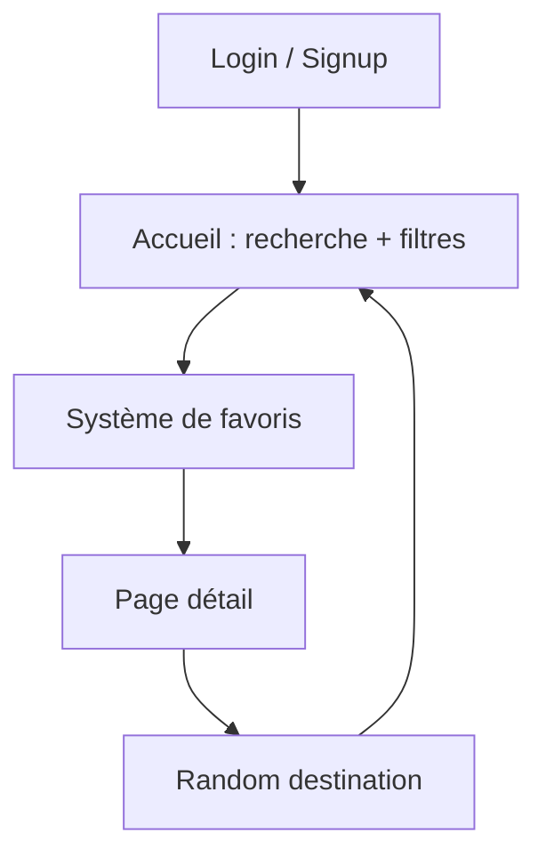

# 🌍 TripGuide — Explore The World in One App  

> **Application Flutter moderne permettant d’explorer des destinations, filtrer par continent/pays, gérer ses favoris et personnaliser son profil (avatar + nom).**

---

## 🧭 Aperçu de l’application

**TripGuide** est une travel-app moderne développée en **Flutter/Dart**, combinant :
- un système **Login / Sign up** complet,
- un **choix d’avatar dynamique** (les avatars sont chargés automatiquement depuis `images/avatar/`),
- des pages animées et un design premium,
- un système de **favoris avancé** (tri, ajout, suppression multiple),
- une page détail immersive avec **"Read more"**, et des **tours recommandés**,
- une fonctionnalité **Random Destination 🎲**.

Cette application offre une expérience fluide, intuitive, et visuellement élégante.

---

 **Démo de l’application :**

**Connexion / Inscription**

Navigation + Recherche + Favoris

---

## ✨ Fonctionnalités principales

### 🔐 Authentification & Profil
- Connexion / Inscription
- Choix du genre (Homme / Femme)
- Sélection d’un avatar (Naruto, personnages animés, etc.)
- Avatar modifiable à tout moment
- Nettoyage intelligent du nom (autorise lettres, chiffres, @ et .)

### 🏠 Accueil
- Message personnalisé : *Hello, Username*
- Recherche intelligente (ville ou pays)
- Message d’erreur si aucun résultat
- Filtrage dynamique par continent
- Tri : pays, continent, aucun tri
- Listing animé et responsive

### ❤️ Favoris
- Ajouter / retirer une destination
- Sélection multiple
- Suppression groupée
- Tri intelligent : ville / pays / continent / note
- Ajout ou retrait via bottom-sheet
- Stocké via `ValueNotifier` (réactif et instantané)

### 📄 Page Détails
- Hero animation
- Flag + pays + reviews + rating
- Description courte + longue (Read More)
- Section "Upcoming tours"
- Liste de destinations mélangées
- Random destination (boutton 🎲)

### 🎨 UI / UX
- Interface premium façon travel-app
- Animations naturelles
- Images HD
- Navigation fluide

---

## 🧠 Logique générale (simplifiée)

---
## 📂 Arborescence du projet
tripGuide/
│
├── lib/
│   ├── main.dart
│   ├── services/
│   │     └── support_widget.dart
│   ├── pages/
│   │     ├── home.dart
│   │     ├── detail_page.dart
│   │     ├── favorites_page.dart
│   │     ├── favorites_manager.dart
│   │     ├── about_page.dart
│   │     ├── destinations_data.dart
│   │     └── login/
│   │            ├── auth_page.dart
│   │            └── user_profile.dart
│   │
│
├── images/
│   ├── avatar/
│   │     ├── boy.png
│   │     ├── girl.png
│   │     ├── gaara.png
│   │     ├── itachi.png
│   │     ├── madara.png
│   │     ├── nagato.png
│   │     ├── pain.png
│   │     ├── kurama.png
│   │     └── hinata.png
│   │
│   ├── villes/
│   ├── pays/
│   ├── filter.png
│   ├── world.gif
│   └── newton.gif
│
├── pubspec.yaml
└── README.md
---
## 🚀 Installation
1️⃣ Cloner le projet
git clone https://github.com/decaho/tripGuide.git
cd tripGuide

2️⃣ Installer les dépendances
flutter pub get

3️⃣ Lancer l’application
flutter run
---
## 🛠️ Technologies utilisées

Flutter 3.x

Dart

Animations Flutter

Hero animations

ValueNotifier (gestion des favoris)

AssetManifest.json (chargement automatique des avatars)

Material Design
---
## 🔥 Points forts techniques
✔ Avatar dynamique via AssetManifest

Aucune liste statique → toutes les images d’un dossier sont automatiquement chargées.

✔ Favoris 100% en temps réel

Avec ValueNotifier<Set<String>>
→ ultra rapide, sans base de données.

✔ Navigation propre avec onGenerateRoute
✔ Système de tri et filtres combinés (continent + recherche + tri)
---
## 💡 Améliorations futures

Ajouter Firebase Auth

Sauvegarder les favoris dans Firestore

Ajouter un mode sombre

Ajouter la géolocalisation

Intégrer une API météo ou Google Places
---
## 👨‍💻 Auteur

Decaho Gbegbe
🧑‍🎓 Baccalauréat en Génie Informatique — Université d’Ottawa
🔗 LinkedIn : https://linkedin.com/in/decahogbegbe

🐙 GitHub : https://github.com/Decaho7059
---
## 📜 Licence
MIT License
