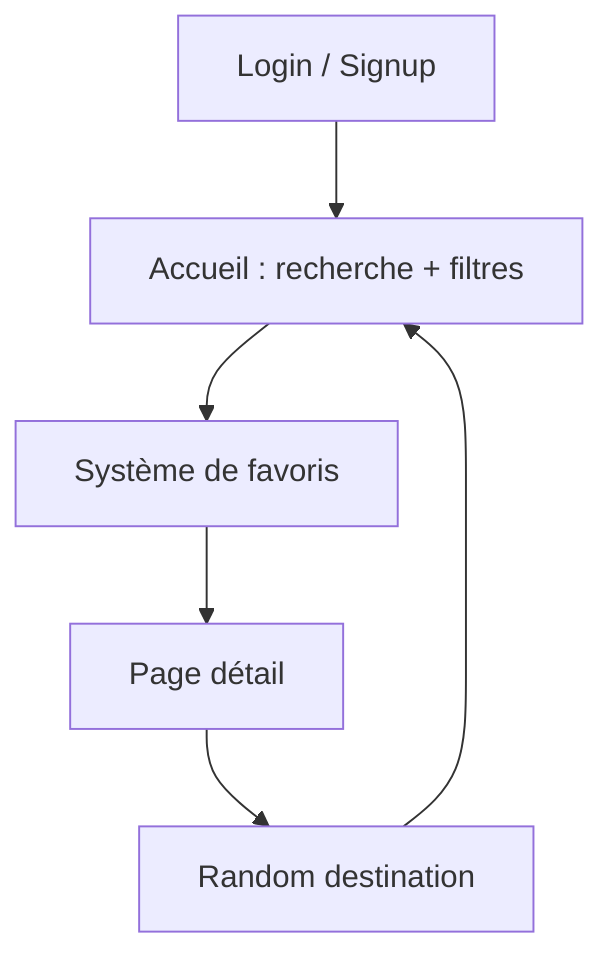

# 🌍 TripGuide — Explore The World in One App  


> **Application Flutter moderne permettant d’explorer des destinations, filtrer par continent/pays, gérer ses favoris et personnaliser son profil (avatar + nom).**

---

## 📑 Sommaire
- [Aperçu](#-aperçu-de-lapplication)
- [Fonctionnalités](#-fonctionnalités-principales)
- [Technologies](#-outils-et-technologies-utilisés)
- [Arborescence](#-arborescence-du-projet)
- [Installation](#-installation)
- [Roadmap](#-améliorations-futures)

---

## 🧭 Aperçu de l’application


**TripGuide** est une travel-app moderne développée en **Flutter/Dart**, combinant :
- un système **Login / Sign up** complet,
- un **choix d’avatar dynamique** (les avatars sont chargés automatiquement depuis `images/avatar/`),
- des pages animées et un design premium,
- un système de **favoris avancé** (tri, ajout, suppression multiple),
- une page détail immersive avec **"Read more"**, et des **tours recommandés**,
- une fonctionnalité **Random Destination 🎲**.

Cette application offre une expérience fluide, intuitive, et visuellement élégante.

---

 **Démo de l’application :**

**Connexion / Inscription**


--- 

Navigation + Recherche + Favoris


---

## ✨ Fonctionnalités principales

### 🔐 Authentification & Profil
- Connexion / Inscription
- Choix du genre (Homme / Femme)
- Sélection d’un avatar (Naruto, personnages animés, etc.)
- Avatar modifiable à tout moment
- Nettoyage intelligent du nom (autorise lettres, chiffres, @ et .)

### 🏠 Accueil
- Message personnalisé : *Hello, Username*
- Recherche intelligente (ville ou pays)
- Message d’erreur si aucun résultat
- Filtrage dynamique par continent
- Tri : pays, continent, aucun tri
- Listing animé et responsive

### ❤️ Favoris
- Ajouter / retirer une destination
- Sélection multiple
- Suppression groupée
- Tri intelligent : ville / pays / continent / note
- Ajout ou retrait via bottom-sheet
- Stocké via `ValueNotifier` (réactif et instantané)

### 📄 Page Détails
- Hero animation
- Flag + pays + reviews + rating
- Description courte + longue (Read More)
- Section "Upcoming tours"
- Liste de destinations mélangées
- Random destination (boutton 🎲)

### 🎨 UI / UX
- Interface premium façon travel-app
- Animations naturelles
- Images HD
- Navigation fluide

---

## 🧠 Logique générale (simplifiée)



## 🧰 Outils et technologies utilisés

| 🧩 **Technologie** | ⚙️ **Utilisation** |
|--------------------|--------------------|
| 🐦 **Flutter 3.35+ / Dart** | Framework principal |
| 🎨 **Material Design** | UI moderne : boutons, cards, inputs, animations |
| 📁 **AssetManifest.json** | Chargement automatique de tous les avatars du dossier images/avatar/ |
| ❤️ **ValueNotifier** | Réactivité instantanée du système de favoris (ajout/retrait sans refresh) |
| 🔍 **Filtering & Sorting** | Recherche dynamique + tri par pays/continent/note |
| 🖼️ **Hero Animations** | Transitions fluides entre Home → DetailPage |
| 📦 **Bottom Sheets modaux** | Sélecteur d’avatar, tri, ajout/retrait de favoris |
| 🌀 **Animated Widgets** | Animations douces sur le scroll et certaines transitions |
| 🧭 **Navigator 1.0** | Navigation entre les différentes pages |
| 🗂️ **Architecture modulaire** | Séparation propre du code : Home, Login, Favorites, Manager, Detail, etc. |
| 🎛️ **Sliver / Grid / ListView** | Affichage responsive des destinations, avatars et favoris |
| ♻️ **Random + Shuffle** | Génération de destinations aléatoires dans "Upcoming Tours" |
| 🖱️ **GestureDetector** | Interaction (clic avatar → changement, clic cœur → favoris) |

---

## 📂 Arborescence du projet

```markdown
tripGuide/
│
├── lib/
│   ├── main.dart
│   ├── services/
│   │     └── support_widget.dart
│   ├── pages/
│   │     ├── home.dart
│   │     ├── detail_page.dart
│   │     ├── favorites_page.dart
│   │     ├── favorites_manager.dart
│   │     ├── about_page.dart
│   │     ├── destinations_data.dart
│   │     └── login/
│   │            ├── auth_page.dart
│   │            └── user_profile.dart
│   │
│
├── images/
│   ├── avatar/
│   │     ├── boy.png
│   │     ├── girl.png
│   │     ├── gaara.png
│   │     ├── itachi.png
│   │     ├── madara.png
│   │     ├── nagato.png
│   │     ├── pain.png
│   │     ├── kurama.png
│   │     └── hinata.png
│   │
│   ├── villes/
│   ├── pays/
│   ├── filter.png
│   ├── world.gif
│   └── newton.gif
│
├── pubspec.yaml
└── README.md
```

## 🚀 Installation
###1️⃣ Cloner le projet
```bash
git clone https://github.com/decaho/tripGuide.git
cd tripGuide
```

###2️⃣ Installer les dépendances
```bash
flutter pub get
```

###3️⃣ Lancer l’application
```bash
flutter run
```

## 🔥 Points forts techniques
```bash
✔ Avatar dynamique via AssetManifest

Aucune liste statique → toutes les images d’un dossier sont automatiquement chargées.

✔ Favoris 100% en temps réel

Avec ValueNotifier<Set<String>>
→ ultra rapide, sans base de données.

✔ Navigation propre avec onGenerateRoute
✔ Système de tri et filtres combinés (continent + recherche + tri)
```
---

### 💡 Améliorations futures
```bash
Ajouter Firebase Auth

Sauvegarder les favoris dans Firestore

Ajouter un mode sombre

Ajouter la géolocalisation

Intégrer une API météo ou Google Places
```


## 👨‍💻 Auteur
```bash
Decaho Gbegbe
🧑‍🎓 Baccalauréat en Génie Informatique — Université d’Ottawa
🔗 LinkedIn : https://linkedin.com/in/decahogbegbe
🐙 GitHub : https://github.com/Decaho7059
```

## 📜 Licence
MIT License
